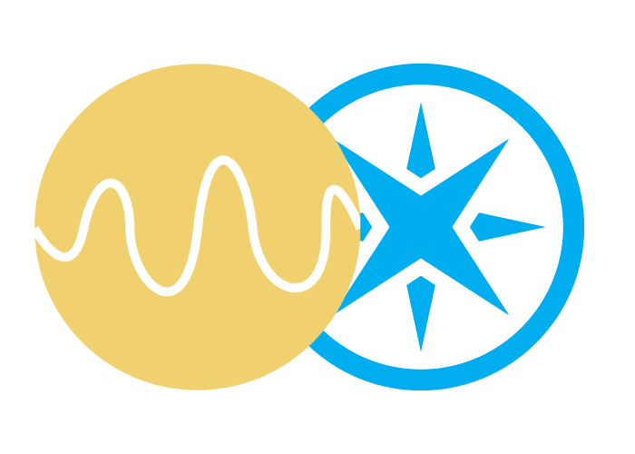

<div style="text-align:center"></div>

# Lux

Internet-connected <a href="https://store.particle.io/collections/photon" target="_blank">Photon</a>-enabled relay module for controlling lights.

## About

This is an IoT open source and open hardware project for controlling a relay over the internet. The project is intended to be used for controlling lights, but it can really be used for controlling anything (coffee machine, fan, heater, water pump, etc.).

This project uses the amazing internet-connected <a href="https://store.particle.io/collections/photon" target="_blank">Photon</a> and a relay module. The photon exposes a function called `relay` to manipulate the relay over the internet and a cloud variable `lightState` to get the current state (on/off).

Read more about Particle variables <a href="https://docs.particle.io/reference/firmware/photon/#particle-variable-" target="_blank">here</a>.

Read more about Particle functions <a href="https://docs.particle.io/reference/firmware/photon/#particle-function-" target="_blank">here</a>.

### The `relay` function

The relay function takes an optional param to determine the kind of action to perform on the relay. If the parameter is not present, the function will toggle the relay (on if it's currently off and vice versa).

Additionally, the parameter can be a string either `on` or `off` to force that state on the relay.

The resulting state is returned as an integer inside the `data` of the response in a variable called `return_value`. If the value is `1` the current state is on.

### The `lightState` variable

Simple. Returns `true` if the relay is on and `false` if it's off.

## Setup

### Materials

- <a href="https://store.particle.io/collections/photon" target="_blank">Photon</a>
- Relay module (like <a href="https://www.amazon.com/SunFounder-Channel-Optocoupler-Expansion-Raspberry/dp/B00E0NTPP4/" target="_blank">this</a> one)
- Breadboard
- Some breadboard jumper wires
- Button (*optional*)
- LED (*optional*)

### Connections

As seen in the code, the relay must be connected to the Photon's `D0` pin, the button to `D2` and the status LED to pin `D7`. Depending on the relay module you might have to connect it to ground and the `5V` pin as well (more info on relays <a href="http://www.instructables.com/id/Controlling-AC-light-using-Arduino-with-relay-modu/" target="_blank">here</a>).

The relay's terminals must be connected as a switch cutting the AC power to whatever you are trying to control. To achieve this I disassemble a power strip (like <a href="https://www.amazon.com/AmazonBasics-6-Outlet-Surge-Protector-Power/dp/B00TP1C1UC" target="_blank">this one</a>) and replaced the switch with my relay.

⚠️ **WARNING**: Be extremely careful when manipulating AC. It's dangerous. If you don't know what you're doing, just don't do it. I am not responsible for you not being careful enough.

## Deploy

To deploy this on your Photon, you have two options: the we IDE provided by Particle or connecting your device via USB to your computer.

I suggest using the IDE because it's the easiest and fastest way.

For the web IDE read <a href="https://docs.particle.io/guide/getting-started/build/photon/" target="_blank">here</a>.

For USB connection read <a href="https://docs.particle.io/guide/getting-started/connect/photon/" target="_blank">here</a>.

### Particle credentials

Once your device is all set, you will need your credentials to operate it.

You will need a device ID and an access token. The device ID can be found [here](https://console.particle.io/devices) and the access token [here](https://build.particle.io) inside the settings.

## Usage

Because we exposed the cloud function and variable, in order to use it we just need to make HTTP calls!

### Webhooks

#### Let there be light

Make an HTTP POST request as follows:

```
POST /v1/devices/<DEVICE-ID>/relay?access_token=<ACCESS-TOKEN> HTTP/1.1
Host: api.particle.io
Cache-Control: no-cache
Content-Type: application/x-www-form-urlencoded

param=on
```

Where `<DEVICE-ID>` is your device's ID and `<ACCESS-TOKEN>` is a valid access token.

Example (cURL):

```sh
$> curl --request POST \
  --url 'https://api.particle.io/v1/devices/9999999999/relay?access_token=AAAA9999ZZZZ' \
  --header 'Cache-Control: no-cache' \
  --header 'Content-Type: application/x-www-form-urlencoded' \
  --data param=on
```

#### Let there be darkness

Make an HTTP POST request as follows:

```
POST /v1/devices/<DEVICE-ID>/relay?access_token=<ACCESS-TOKEN> HTTP/1.1
Host: api.particle.io
Cache-Control: no-cache
Content-Type: application/x-www-form-urlencoded

param=off
```

Where `<DEVICE-ID>` is your device's ID and `<ACCESS-TOKEN>` is a valid access token.

Example (cURL):

```sh
$> curl --request POST \
  --url 'https://api.particle.io/v1/devices/9999999999/relay?access_token=AAAA9999ZZZZ' \
  --header 'Cache-Control: no-cache' \
  --header 'Content-Type: application/x-www-form-urlencoded' \
  --data param=off
```

#### Let there be toggle

Make an HTTP POST request as follows:

```
POST /v1/devices/<DEVICE-ID>/relay?access_token=<ACCESS-TOKEN> HTTP/1.1
Host: api.particle.io
Cache-Control: no-cache
Content-Type: multipart/form-data;
```

Where `<DEVICE-ID>` is your device's ID and `<ACCESS-TOKEN>` is a valid access token.

Example (cURL):

```sh
$> curl --request POST \
  --url 'https://api.particle.io/v1/devices/9999999999/relay?access_token=AAAA9999ZZZZ' \
  --header 'Cache-Control: no-cache'
```

#### Get the current state

Make an HTTP GET request as follows:

```
GET /v1/devices/<DEVICE-ID>/lightState?access_token=<ACCESS-TOKEN> HTTP/1.1
Host: api.particle.io
Cache-Control: no-cache
```

Where `<DEVICE-ID>` is your device's ID and `<ACCESS-TOKEN>` is a valid access token.

Example (cURL):

```sh
$> curl --request GET \
  --url 'https://api.particle.io/v1/devices/9999999999/lightState?access_token=AAAA9999ZZZZ' \
  --header 'Cache-Control: no-cache'
```

You will get a response like this:

```json
{
  "cmd": "VarReturn",
  "name": "lightState",
  "result": false,
  "coreInfo": {
    "last_app": "",
    "last_heard": "2018-05-24T09:36:46.971Z",
    "connected": true,
    "last_handshake_at": "2018-05-11T11:29:18.741Z",
    "deviceID": "9999999999",
    "product_id": 1
  }
}
```

The `result` attribute is what you're interested in.

### Android App

I also built an Android app using Meteor to control this switch. Go check it out: [github.com/juangesino/photon](https://github.com/juangesino/photon).

## Contributing

1. Fork it ( https://github.com/juangesino/lux/fork )
2. Create your feature branch (`git checkout -b my-new-feature`)
3. Commit your changes (`git commit -am 'Add some feature'`)
4. Push to the branch (`git push origin my-new-feature`)
5. Create a new Pull Request

## License

See [MIT-LICENSE](https://github.com/juangesino/lux/blob/master/LICENSE).
